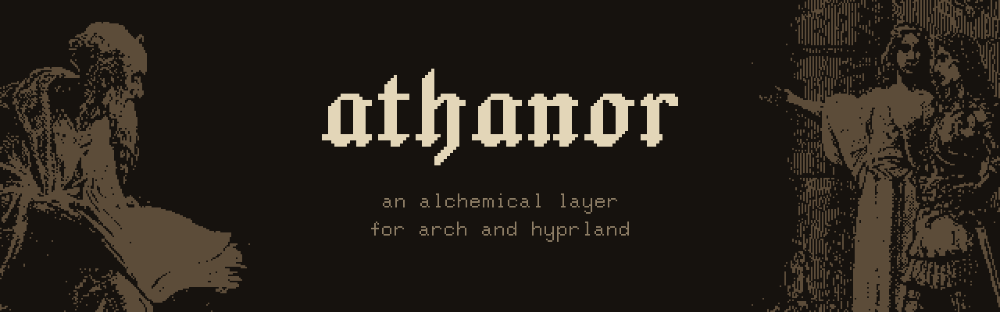

Athanor is an alchemical layer for Arch and Hyprland, inspired by Western
esotericism and dungeon crawling.

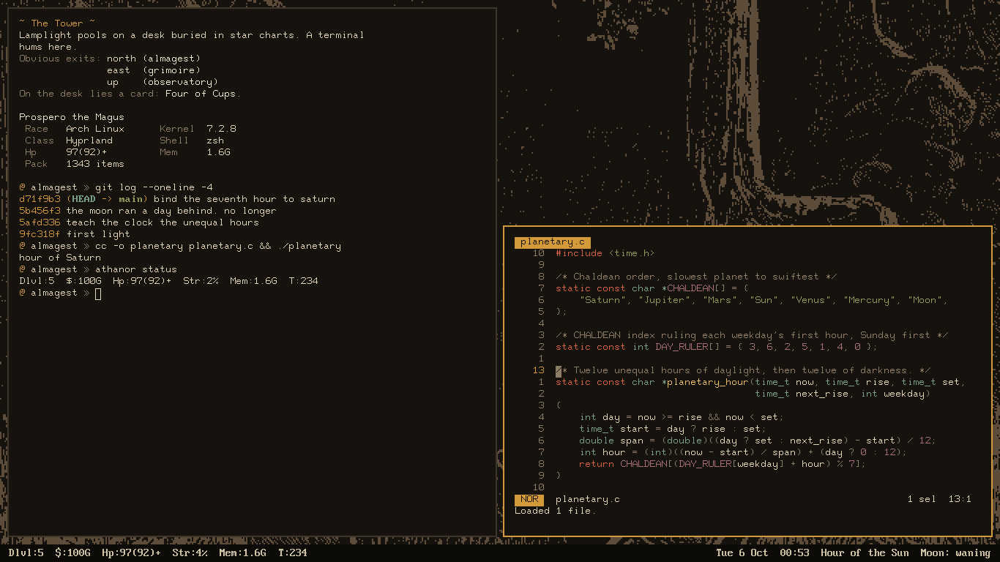

## The Signs

The bar shows the planetary hour. Athanor calculates it from your own sunrise
and sunset and pairs each hour with a tarot trump from the Golden Dawn. Each
machine draws its own card of the day and gets a lockscreen sigil made from its
SSH host key. `athanor draw 3` lays a three-card spread. When a program crashes
you get a notification and `athanor tomb` draws its tombstone.

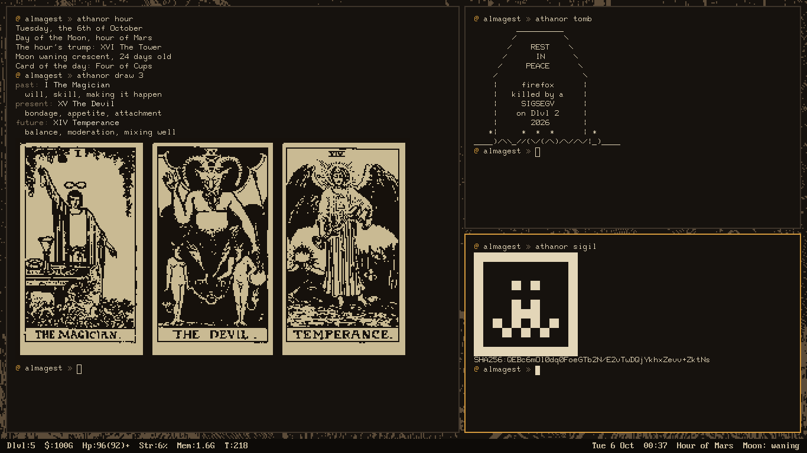

## The Colors

There are four color schemes. Each one is a stage of the alchemical Magnum
Opus: Umber is *nigredo*, Vellum is *albedo*, Orpiment is *citrinitas* and
Cinnabar is *rubedo*. Switch between them with `athanor transmute`. If you set
`stages = true` they change on their own as the sun moves through the day.

| | |
|---|---|
| 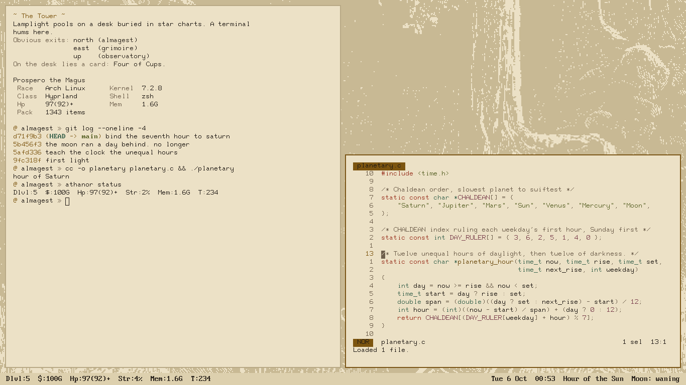 | 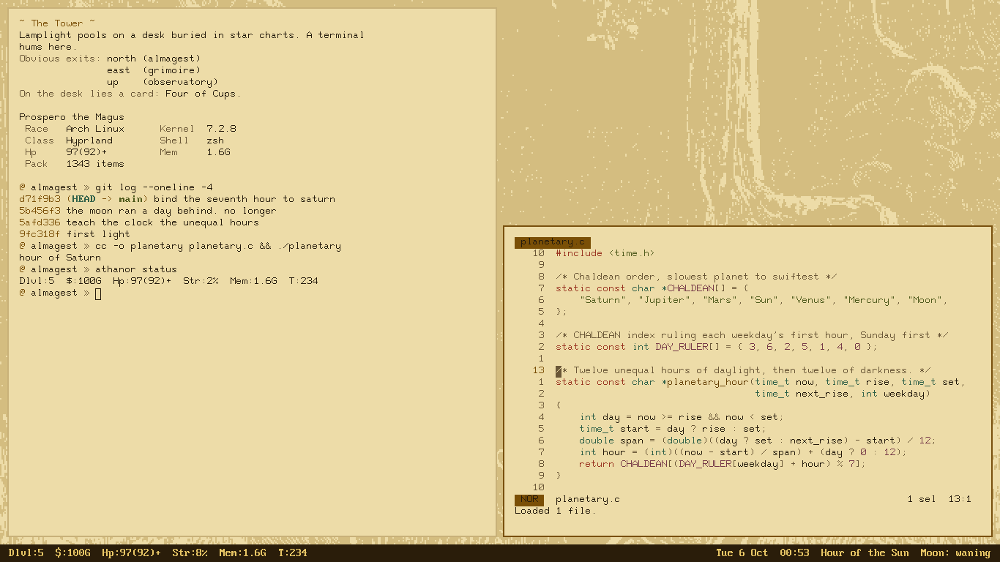 |
| 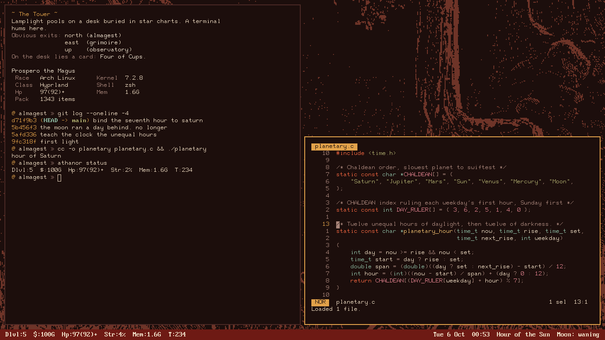 | 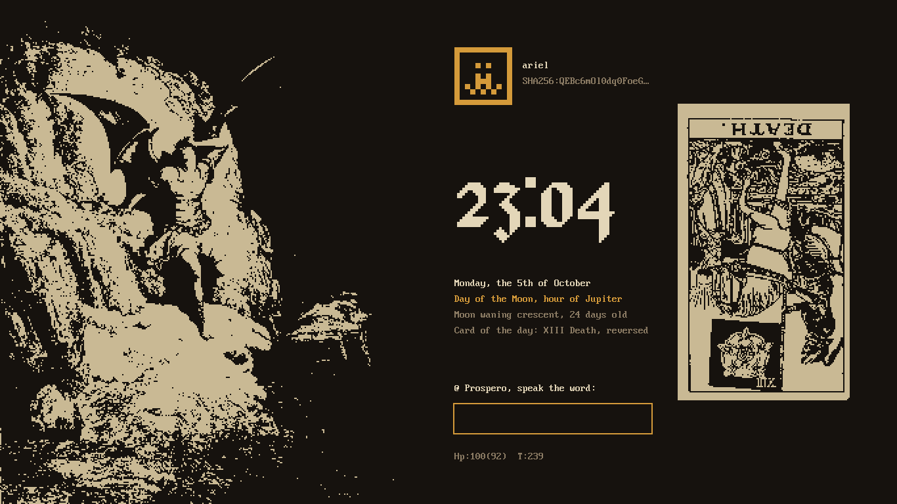 |

The colors are named after old pigments. Orpiment is a yellow arsenic ore whose
name means gold paint. Cinnabar is the mercury ore that vermilion was ground
from. Body text has at least 7:1 contrast against the background and every
accent has 4.5:1.

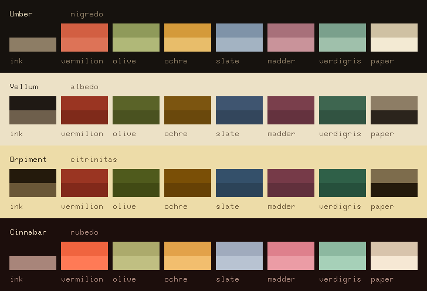

## The Levels

The seven workspaces are dungeon levels. There's one for each classical planet
and each has its own Doré engraving dithered down to two tones.

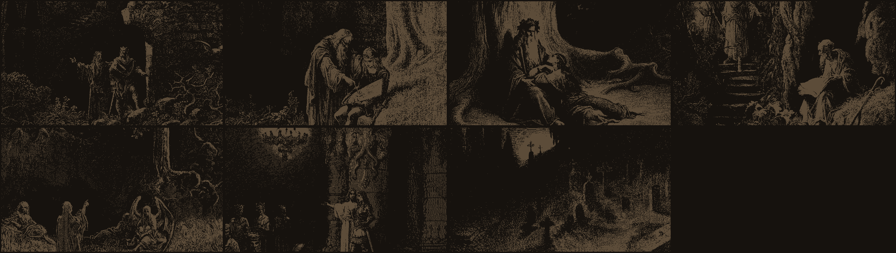

## The Screen

The bar at the bottom is a roguelike status line. `Dlvl` stands for dungeon
level and shows the workspace you're on. `$` is free disk space. `Hp` is the
battery and `T` counts minutes since boot. Notifications show up one at a time
on the top line. `--More--` means more are waiting.

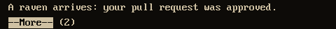

Super+Shift+E asks before quitting Hyprland. Run `athanor guide` for the rest.

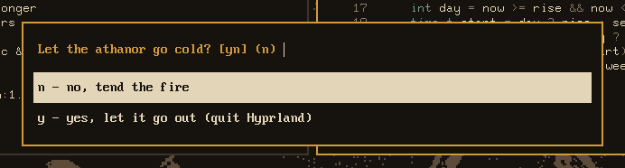

## Install

```sh
git clone https://github.com/script-wizards/athanor
cd athanor
./install.sh --dry-run
./install.sh
```

Athanor keeps its files in `~/.config/athanor`. Outside that folder it only
adds a marked block to the top of your `.zshrc` and your `hyprland.lua`. Your
own settings load after the block and override it.

Without Hyprland, `./install.sh shell` installs just the command, the prompt and
the fonts. `./install.sh --uninstall` removes everything.

## The Name

An athanor was an alchemist's furnace. The word comes from the Arabic
*al-tannūr* (the oven). Tandoor comes from the same root. The furnace was built
as a tower filled with charcoal that slid down into the fire as it burned. That
let it hold a low steady heat for weeks without anyone tending it. When did you
last turn off your laptop?

## Inspirations

Athanor borrows from Doré, the Golden Dawn, NetHack and a lot more. The full list
is in [INSPIRATIONS.md](INSPIRATIONS.md).

## License

MIT. The plates, cards and fonts have their own terms, listed in
[NOTICE.md](NOTICE.md).
